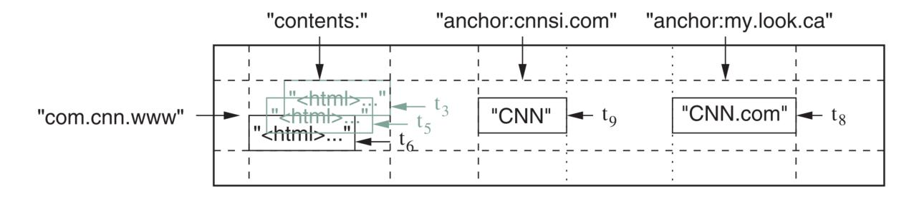
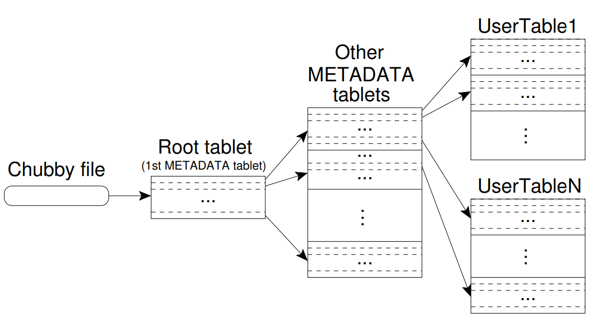
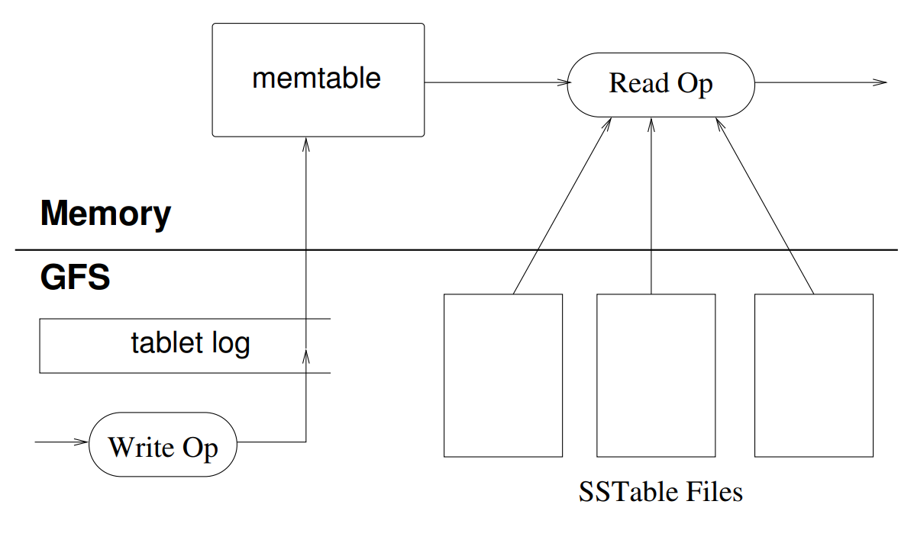
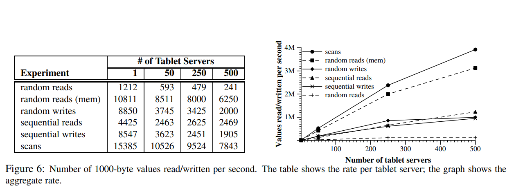

# Big Table

简介

分布式存储系统，用来管理结构化的数据，可以管理PB级的数据。

# Design of Big Table

## 是什么

Big Table是一个分布式的结构化数据库，可以管理PB级的数据。

## Data Model

&ensp;&ensp;&ensp;&ensp;稀疏、分布式、持久化的多维排序map，通过row key、column key、timestamp进行索引。

+%5Crightarrow+%5Ctextrm%7Bstring%7D)

- Row key: "com.cnn.www"

- column family:  "contents", "anchor"

- 链接到当前网页的网页："cnnsi.com"、"my.look.ca"

- timestamp：t3、t5、t6、t8、t9

Bigtable 会把数据存储在若干个 Table（表）中，Table 中的每个 Cell（数据单元）的形式下：

Cell 内的数据由字节串（`string`）构成，使用行、列和时间戳三个维度进行定位。

### Rows

对于单个row的读写是原子的，所有数据按照row key 字典序排序

#### tablet

一个row range，动态分区，是分布式和负载均衡的基本单位。

因此，对小的range的读写是高效的。需要在排序层面保证访问的locality

### Column Families

`family:qualifier`

column key的分组，是访问控制的基本单位。单个cf里的数据通常是相同类型的（为了能够进行数据压缩）。期望对cf的改动非常少。

计算也在cf层面上进行，于是就可以有的应用负责计算，有的应用负责查看。

## Timestamps

64-bit integers，不同版本的数据降序排列。

## Chubby

分布式锁服务（其实是一个分布式的文件系统，读写能够保证原子性，因此可以通过对文件和目录的读写来实现锁，非常类似现在流行的用redis实现分布式锁的思路），基于paxos实现，Bigtable使用Chubby来完成:

- tablet server注册和发现

- master注册和发现（保证唯一性）

- 存储结构信息

- 存储访问控制列表

## Implementation

### tablet location

BT用三层结构的B+树来记录tablet位置。

- root tablet保存所有METADATA tablet的信息

- root tablet不会被切分

- METADATA 大小限制为128MB，每行大约1KB

- METADATA中的每一行代表big table中的一个tablet，row key为根据 tablet对应的 table identifier 和row key的最大值（上限）编码出的值

- 最多能索引2^34个tablet

- 优化：客户端提前获取tablet location

### Tablet assignment

调度都由唯一的master控制进行。

- 未分配的tablet + 有足够空间的tablet server → master调度 tablet load

- 网络异常→lock released

- lock released → master调度→重新分配tablet

### Tablet serving

&ensp;&ensp;&ensp;&ensp;持久化数据都保存在GFS当中。

&ensp;&ensp;&ensp;&ensp;

一个tablet包含：

- 一堆SSTable Files （GFS中）

- 一堆tablet log（GFS中）

- 一个memtable（内存中）

所有的操作都会提交给tablet commit log（包含redo记录），最近的提交会保存在memtable中，旧的记录在一系列的SSTable中。

恢复tablet时，从METADATA table中读取到SSTable的信息，它包含tablet和一系列的redo points（指向可能包含当前tablet data的commit log），然后根据redo point和之后的commit log重建memtable。

写操作：通过针对小的变更采用Group Commit来提高吞吐。

读操作：可能需要合并memtable和SSTable，但是因为本身有序，所以合并相对高效。

### Compaction

minor compaction：memtable增长到一个阈值后就冻结并转为为SSTable，同时创建新的memtable。

major compaction：合并多个SSTable到单个SSTable，同时将标记删除清除掉。

### Refinement

#### Locality Group

- 将多个CF放入一个LG，一个tablet的一个LG产生一个单独的SSTable，将并不同时访问的CF放入不同的LG。

- LG可以通过参数控制一些行为，可以指定单个LG是in-memory的。

&ensp;&ensp;&ensp;&ensp;- METADATA中的location所在LG就被指定为了in-memory的

#### Compression

可以控制对LG的SSTable进行压缩（是否要对数据进行压缩以及使用何种格式进行压缩），提高存储的效率（比如极少使用的一些Column Family）。

压缩是基于 SSTable 文件的 Block 进行的，而不是对整个文件直接进行压缩。尽管这会让压缩的效率下降，但这也使得用户在读取数据时 Bigtable 只需要对 SSTable 的某些 Block 进行解压。

## 读缓存与 Bloom Filter

- 读缓存由两个缓存层组成：

&ensp;&ensp;&ensp;&ensp;- 高层次的 *Scan Cache*  缓存从SSTable接口返回到tablet server的键值对

&ensp;&ensp;&ensp;&ensp;- 低层次的 *Block Cache*  缓存从GFS中读到的SSTable

读操作必须读取构成这个tablet的所有SSTable，而假如有SSTable不在缓存中，就会产生很多的磁盘操作。Bigtable 允许用户为某个 Locality Group 开启 Bloom Filter 机制，通过消耗一定量的内存保存对 SSTable 文件构建的 Bloom Filter，能够提供查询一个SSTable是否包含某个行/列对的能力，某些场景下能够极大减少需要读取的 SSTable 文件数。

## Commit Log

使用了 Write-Ahead Log 的做法来确保数据高可用，便涉及了大量对 Commit Log 的写入，因此这也是个值得优化的地方。
首先，如果 Bigtable 为不同的 Tablet 使用不同的 Commit Log，那么系统就会有大量的 Commit Log 文件同时写入，提高了底层磁盘寻址的时间消耗。为此，Tablet Server 会把其接收到的所有 Tablet 写入操作写入到同一个 Commit Log 文件中。
这样的设计带来了另一个问题：如果该 Tablet Server 下线，其所负责的 Tablet 可能会被重新分配到其他若干个 Tablet Server 上，它们在恢复 Tablet MemTable 的过程中会重复读取上一个 Tablet Server 产生的整个Commit Log。为了解决该问题，Tablet Server 在读取 Commit Log 前会向 Master 发送信号，Master 就会发起一次对原 Commit Log 的排序操作：原 Commit Log 会按 64 MB 切分为若干部分，每个部分并发地按照 `(table, row name, log sequence number)` 进行排序。完成排序后，Tablet Server 读取 Commit Log 时便可只读取自己需要的那一部分，减少重复读取。

#### Speeding up tablet recovery

如果master将一个tablet从一个tablet server转移到另一个tablet server，那么源tablet server会先对那个tablet做一次次压缩。这次压缩减少了tablet server中提交日志的未压缩状态的数量，减少了恢复时间。完成了这次压缩之后，源tablet server就停止对这个tablet的服务。在卸载这个tablet之前，源tablet server还会做另一次次压缩，删除tablet server的日志中任何未压缩状态（这些未压缩状态是在第一次次压缩时到达的，所以通常这第二次次压缩是很快的）。在第二次压缩结束之后，tablet就可以被直接加载到另一个tablet server了，不需要请求日志条目来恢复状态。

### Exploiting immutability

除了SSTable cache，BigTable系统的许多其他部分也已经被简化。这样的策略是基于一个前提：SSTable都是不变的。例如，当我们从SSTable中读取数据时，不需要进行任何文件系统访问的同步。这样就可以让我们高效执行行级别的并发控制。唯一会发生数据变化的是memtable，它可以同时被读和写。为了减少读取memtable的冲突，我们使每个memtable行采取"copy-on-write"，并且允许读操作和写操作同时进行。

## Performance

- a GFS cell consisting of 1786 machines with two 400 GB IDE hard drives each

- 100-200Gbps bandwidth

- dual-core 2GHz CPU

### 单个Tablet Server

- 75MB/s

- 实际中更快

### Scaling

- 负载不均衡造成节点增加时性能不能线性增长

- random read读取时，需要按照SSTable从GFS中读取数据

# 参考文献

[https://research.google/pubs/pub27898/](https://research.google/pubs/pub27898/)

[https://zhuanlan.zhihu.com/p/35687103](https://zhuanlan.zhihu.com/p/35687103)

