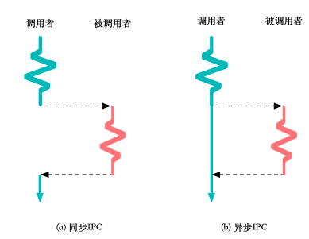

# 进程间通信

进程协作的达成依赖于进程间通信，所谓 IPC，是两个（或多个）不同的进程，通过内核或其他共享资源进行通信，来传递控制信息或数据。交互的双方被称为发送者/接收者，通信的内容称为消息。


## IPC 基础

### 一个简单的 IPC 设计

最简单的 IPC 设计，假设只涉及两个进程，一个接收者一个发送者。在不考虑 IPC 的时候，两个进程是通过内核隔离开来的，它们处在不同的地址空间。现在为了实现一个简单的 IPC，假设内核已经为两个进程映射了一段**共享内存**。有了共享内存，两个进程就相当于有了一个中间缓冲区，可以通过这个中间缓冲区来通信。

我们可以把共享内存想象成共享的快递桌，发送者是快递员，在桌上放快递，接收者是小明，从桌上取快递。


这种实现的挑战在于：1）发送者不能覆盖未读取的数据；2）接收者不能读取别的数据。

一种可能的实现如下可能如下。

**共享区域**：


**发送者**：


**接收者**：


这种实现存在什么问题呢？首先，数据的发送和获取是**轮询**的，这就导致了资源的浪费。如果我不采用轮询，转而使用一个固定的检查时间，那意味着一个较长的时延。

那接下来就很自然引入一个问题，OS 该如何设计 IPC？

### IPC 设计选择

1. **如何进行数据传递？**

从简单的 IPC 设计可以看到，IPC 的一个重要功能是进程间传递数据，将数据抽象成一个个消息进行传递。使用简单的 IPC 方案采用的是**基于共享内存的消息传递**，这种实现方式意味着 OS 只在一开始为进程分配好了共享内存空间，不参与后续的通信过程。

另一种方式就是**基于 OS 的消息传递**，其具体实现仍然可以使用共享内存，但是借助内核来保证时延。比方说，OS 提供了 NOTIFY 的系统原语，这就可以既不浪费计算资源又可以低时延。

从性能的角度来看，基于共享内存的消息传递可以做实现理论上零拷贝的传输，而基于 OS 的消息传递，通常用 CPU 访存指令来实现，那么就需要先将数据从用户态拷贝到内核态再从内核态拷贝回用户态，涉及两次数据拷贝。但是，基于 OS 的消息传递也有不少好处，首先，基于 OS 的消息传递抽象更简单，调用来自于 OS 原语，将复杂交给 OS，而基于共享内存则需要由用户态的软件来封装实现；其次，基于 OS 的方案隔离型更强，没有绕开内核，保证了安全。

2. **通信方式如何选择**？

最直观的方式就是**直接通信**，每个进程都有一个唯一的 PID，我们就可以很快构建直接通信的签名：

```c
// 给进程 P 发送一个消息
Send(P, message);
// 从进程 Q 接收一个消息
Recv(Q, message);
```

直接通信意味着一个连接唯一地对应一对进程，比如：


在这种情况下，接收者 Recv 会一直阻塞，直到 Send 发送消息过来。

另一种是**间接通信**，进程的连接建立在一个共享信箱上，那签名就变成：

```c
// 给信箱 M 发送一个消息
Send(M, message);
// 从信箱 M 接收一个消息
Recv(M, message);
```


3. **信息传递同步/异步**？



**同步意味着阻塞，异步意味着非阻塞**。阻塞的发送/接收代表发送者/接收者一直处于阻塞状态，直到消息发出/到来，同步通信通常有着更低时延和易用的编程模型。非阻塞意味着发送者/接收者不等待操作结果，直接返回，使用异步通信的模式七带宽一般更高。

同步的消息传递还意味着必须有**超时机制**，比如它的函数签名可能是：

```c
// 超过 timeout 就返回错误
Send(A, message, Timeout)
```

很显然，有两种特殊的 timeout，一种是永远等待（阻塞），一种是永不等待（非阻塞）。超时机制的引入可以避免由通信造成的拒接服务攻击等。

## IPC 机制

> ❓ 经典面试题，进程间通信都有哪些方法？
>
> 管道（匿名管道，有名管道），消息队列，信号量，信号，socket，共享内存，文件

### Unix 管道

Pipe 是一种非常重要的 IPC 机制，两个进程共享一根管道，一个进程是发送者，一个是接收者。一个最常见的例子：

```shell
$ ls | grep ipc
```

Pipe 具有以下特点：

* 单向通信，缓冲区满的时候阻塞；
* 一个 pipe 有且只有 2 个端口，一个负责输入，一个负责输出；
* 数据不带类型，即字节流；
* 基于 unix 的文件描述符使用。


>  ❓管道的连接如何建立的？
>
>  以匿名管道为例子。匿名管道通过 pipe 的系统调用创建，在创建时候获得两个读写的端口（两个 fd），在这种情况下，通常结合 fork 的使用，用继承的方式来实现父子进程的连接，具体方式如下：
>
>  1. 父进程首先通过 pipe 创建 pipe 两端对应的 fd；
>  2. fork 创建子进程；
>  3. 由于子进程可以继承 fd，父子进程相当于通过 fork 进程完成了一次 IPC 权限的分发；
>  4. 父子进程通过管道来进行进程间通信。

接下来，我们以 Xv6（Unix v6）的实现为例子，看一下管道的实现。

管道的数据结构主要有：


一个 pipe 的写操作实现如下：


> ❓ pipe 写的实现能保证数据的完整性吗？
>
> 无法保证

一个 pipe 的读操作实现如下：


注意这里参数 n 的大小是无法有一个准确值的，因为 read 无法确定 write 的字节数，**因此 pipe read 读取到的是一个字节流，而没有确切固定的消息**。

在 Xv6 中，pipe 的实现依赖于 sleep 和 wakeup 两个接口，这是经典的进程间 WAIT 和 NOTIFY 的机制。而信道（Channel）是用来作为等待和通知的媒介，因此，一个进程可以通过 sleep 接口将自己 WAIT 在某个 channel 上，另一个进程可以通过 wakeup 接口将某个 channel 上的进程唤醒。

管道的设计和实现都非常简单，因此它针对简单通信场景十分优秀，然而它也有如下缺点：

1. **缺少消息类型**，接收者需要对消息内容进行解析；
2. 缓冲区大小**预先分配且固定**；
3. 只能支持最多**两个**进程间通信；
4. 只能支持**单向通信**：想象一下目前实现的机制下，如果 pipe 能双工通信会发生什么？由于 pipe 的数据结构中只有一个缓冲区，一个 pipe 的一端可能刚写完数据就读到了自己写的数据。显然，如果要支持 pipe 双工通信，我们需要在现有的数据结构中添加一个新的缓冲区，然而，从设计的角度来说，我们通过 fd 来进行 pipe 数据的读写，本质上，我们是将 pipe 的读写当作对文件读写的抽象，那么对于同一个 fd，双工通信的实现从使用者的角度来说会给人一种“我写的数据和我读的数据不一致”的感觉，这个和文件的抽象是相违背的。然而，实际上 socket 的实现却确实是在同一个 fd 上进行读写。

### 消息队列

消息队列是一种以**消息**为数据抽象的 IPC 通信方式，因此它是非常灵活的通信机制。它的结构如下图：


可以看到，它以链表的方式组织消息，任何有权限的进程都可以访问队列，写入数据或读取数据。消息队列是一种间接的消息传递方式，通过共享一个队列来建立连接，同时，它支持异步非阻塞通信。消息的格式是类型 + 数据，其类型由一个整形表示，具体的意义由用户决定。消息队列涉及以下几个原语：

```c
// 根据参数内容返回一个 key，key 唯一标识该消息队列
Ftok(path, secret)
// 根据 key 获得消息队列 id
Msgget(key, permit)
// 发送数据至消息队列
Msgsend(msgid, type, message)
// 接收来自消息队列的数据
Msgrcv(msgid, type, message)
// 控制消息队列的生命周期
Msgctl(msgid, ...)
```

一个简单的例子如下：


消息队列相比管道更加灵活易用，但是实现也更加复杂。

* 缓存区设计：
  * 消息队列：链表的组织方式，动态分配资源，可以设置很大的上限；
  * 管道: 固定的缓冲区间，分配过大资源容易造成浪费；
* 消息格式:
  * 消息队列: 带类型的数据；
  * 管道: 数据 (字节流)；
* 连接上的通信进程:
  * 消息队列: 可以有多个发送者和接收者；
  * 管道: 两个端口，最多对应两个进程；
* 消息的管理:
  * 消息队列: FIFO + 基于类型的查询；
  * 管道: FIFO。

## Modern IPC: LRPC

传统的基于 OS 的 IPC 通信机制通常十分重量级，这里的重量级体现在：

* 通知机制涉及用户态和内核态之间的切换；
* 通知和唤醒之间是一个系统的调度，期间存在其他进程的执行；
* 数据的传输需要通过 CPU 进行。

所以，现有 IPC 机制缺少一种远程调用机制，相当于客户端进程切换到服务端进程，执行特定的函数。但是正常的 RPC 通信开销太昂贵了，因此，提出一种 Lightweight Remote Procedure Call，简称 LRPC。

LRPC（[1989 年 SOSP 的论文](https://homes.cs.washington.edu/~tom/pubs/lrpc.html)）是一种极端的优化性能的 IPC 通信方式。它的核心在于解决两个问题，

* **控制流转换**：调用者进程快速通知被调用者进程；
* **数据传输**：将栈和寄存器参数传递给被调用者进程。


我们回顾一下正常的控制流转换，控制流转换需要下陷到内核，内核系统为了保证公平等，会在内核中根据情况进行调度，这意味着**调用者和被调用者之间可能会执行多个不相关进程**。


因此，LRPC 提出了一个叫做**迁移线程**的概念，它将调用者运行在被调用者的 context。

使用迁移线程的模型，在进程间通信过程中，**内核不会阻塞调用者线程，但是会让调用者执行被调用者的代码**。整个过程没有被调用者线程被唤醒，被调用者更像是一个“代码提供者”，此外，内核不会进行完整的上下文切换，只切换地址空间（页表）等和请求处理相关的系统状态。因此，迁移线程减少了内核调度的时间，简化了内核的 IPC 处理。


我们再回顾一下正常 IPC 的数据传输，首先它会经历两次拷贝（调用者 -> 内核 -> 被调用者），数据拷贝本身就很慢，因为它是一个内存指令，其次，数据拷贝的扩展性也差，数据流增加 10 倍，拷贝时间就增加 10 倍。


LRPC 的关键设计在于**共享参数栈和寄存器**，系统内核为每一对 LRPC 连接预先准备好了一个参数栈，称为 A-stack，并将其同时映射在客户端进程和服务端进程的内存地址空间，调用者只需要将参数准备到 A-stack 就可以了，这就避免了内核额外的数据拷贝。而执行栈，简称 E-stack。另外，LRPC 还共享通用寄存器，普通的上下文切换，需要保存当前的寄存器状态然后切换到另一个进程的寄存器状态，而 LRPC 直接使用当前的通用寄存器，类似函数调用中用寄存器传参。

在这样的设计下，LRPC 的通信连接建立过程如下：

1. 被调用者进程通过内核注册一个**服务描述符**，对应被调用者进程内部的一个处理函数；
2. 内核为服务描述符预先分配好 A-stack；
3. 内核为服务描述符分配好**调用记录**，调用记录主要是记录调用过程中的信息，类似函数调用中往函数栈压入函数的返回地址；
4. 内核将 A-stack 交给客户端进程，作为一个**绑定对象**的标志，在之后的通信过程中，通过检查 A-stack 来判断调用者是否正确发起通信。

那么，一次 LRPC 的调用就十分清晰了：

1. 内核验证**绑定对象**的正确性，并找到正确的**服务描述符**；
2. 内核验证 **A-stack** 和**连接记录**；
3. 检查是否有并发调用 (可能导致 **A-stack** 等异常)；
4. 将调用者的返回地址和栈指针放到**连接记录**中；
5. 将**连接记录**放到线程控制结构体中的栈上 (支持嵌套 LRPC 调用)；
6. 找到被调用者进程的 **E-stack** (执行代码所使用的栈)；
7. 将当前线程的栈指针设置为被调用者进程的运行栈地址；
8. 将地址空间切换到被调用者进程中；
9. 执行被调用者地址空间中的处理函数。

## Ref

* [现代操作系统：原理与实现（银杏书）](https://ipads.se.sjtu.edu.cn/mospi/#)
* [Slides](https://ipads.se.sjtu.edu.cn/courses/os/slides/OS-08%20IPC.pdf)

