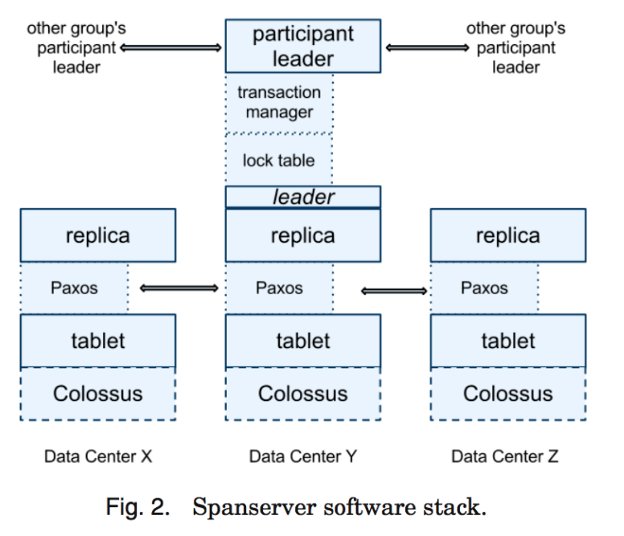

# Spanner

F1的基础，2012年谷歌发布，用于实现分布式的一致性数据库（CP系统）

简介

- paxos一致性保证 

- 副本分片（跨中心）

- 自动重新分布

对比：

- mega store：写操作吞吐差

- bigdata：不具备可变的模式，一致性不足

特性：

- 可以很细粒度下控制数据的副本配置（比如副本数、数据分布、副本分布等）

- 读操作和写操作的外部一致性

- 基于时间戳的跨库的全局一致性读，因此可以进行具备一致性的备份、MapReduce等

魔法：TrueTime API，通过暴露时钟不确定性 + 调节等待时间来保证解决一致性，借助GPS和原子钟来见地不确定性

# 实现

## 一个Universe的结构

一个 Spanner 部署称为一个 universe

当前谷歌有正在运行一个测试用的 universe，一个部署/线上用的 universe 和一个只用于线上应用的 universe。

一个 zone 包括一个 zonemaster， 和一百至几千个 spanserver。

universe master 主要是一个控制台，它显示了关于 zone 的各种状态信息，可以用于相互之间的调试。Placement driver 会周期性地与 spanserver 进行交互，来发现那些需要被转移的数据，或者是为了满足新的副本约束条件，或者是为了进行负载均衡

## 一个spanserver的结构

每个 spanserver 负载管理 100-1000 个称为 tablet 的数据结构的实例。一个 tablet 就类似于 BigTable 中的 tablet，也实现了下面的映射: (key:string, timestamp:int64)->string

# True Time API

在底层，TrueTime 使用的时间是 GPS 和原子钟。TrueTime 使用两种类型的时间，是因为它们有不同的失败模式。GPS 参考时间的弱点是天线和接收器失效、局部电磁干扰和相关失败(比如设计上的缺陷导致无法正确处理闰秒和电子欺骗)，以及 GPS 系统运行中断。原子钟也会失效，不过失效的方式和 GPS 无关，不同原子钟之间的失效也没有彼此关联。 由于存在频率误差，在经过很长的时间以后，原子钟都会产生明显误差。

TrueTime 是由每个数据中心上面的许多 time master 机器和每台机器上的一个 timeslave daemon 来共同实现的。大多数 master 都有具备专用天线的 GPS 接收器，这些 master 在物理上是相互隔离的，这样可以减少天线失效、电磁干扰和电子欺骗的影响。剩余的 master (我们称为 Armageddon master)则配备了原子钟。一个原子钟并不是很昂贵:一个 Armageddon master 的花费和一个 GPS master 的花费是同一个数量级的。所有 master 的时间 参考值都会进行彼此校对。每个 master 也会交叉检查时间参考值和本地时间的比值，如果二者差别太大，就会把自己驱逐出去。在同步期间，Armageddon master 会表现出一个逐渐增加的时间不确定性，这是由保守应用的最差时钟漂移引起的。GPS master 表现出的时间不确定性几乎接近于 0。

# 实验

benchmark

每个 zone 都包含一个 spanserver。客户端和 zone 都放在一个数据中心集合内，它们之间的网络距离不会超过 1ms。这种布局是很普通的，许多数据并不需要把数 据分散存储到全球各地)。测试数据库具有 50 个 Paxos 组和 2500 个目录。每个 spanserver 采用 4GB 内存和四核 CPU(AMD Barcelona 2200MHz)。

可用性

